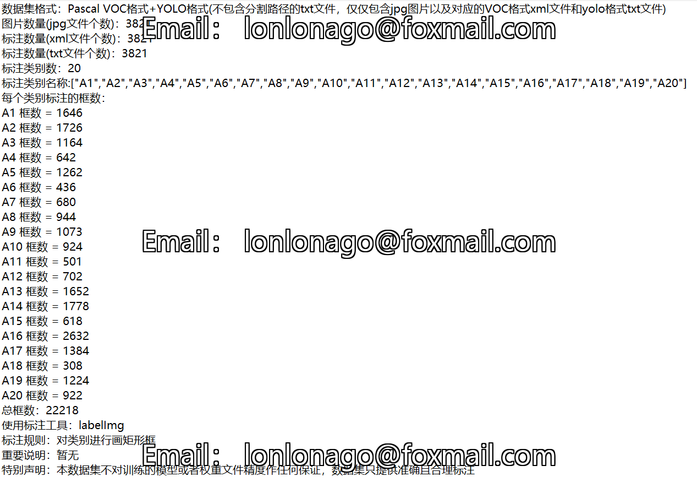
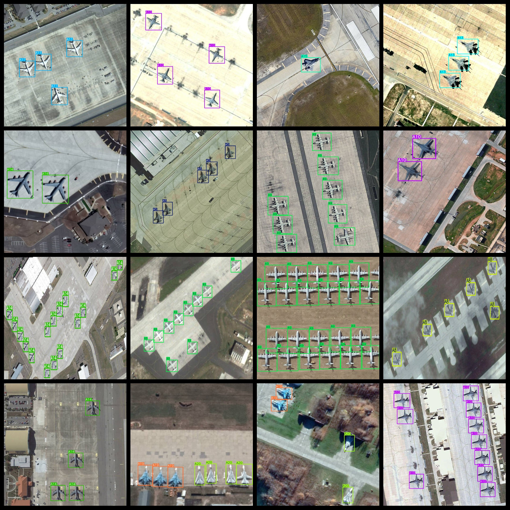
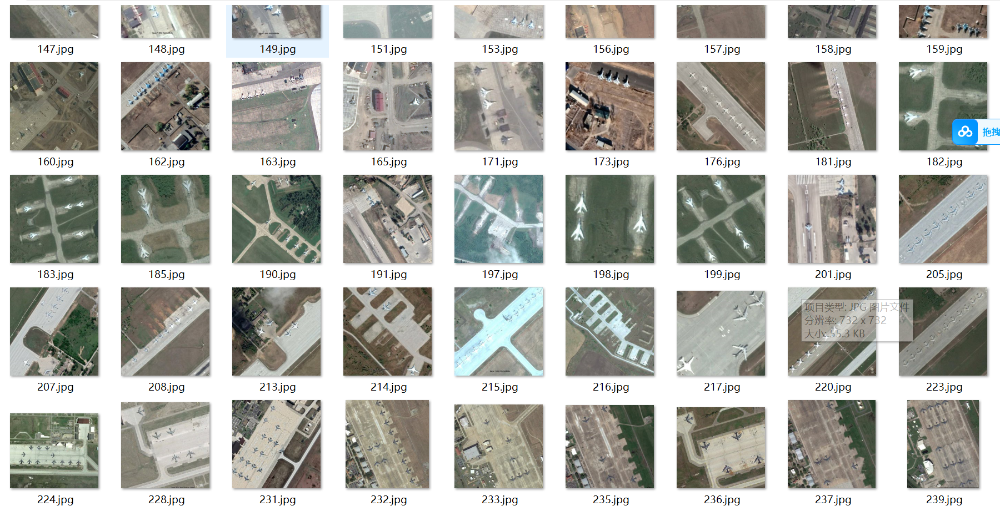
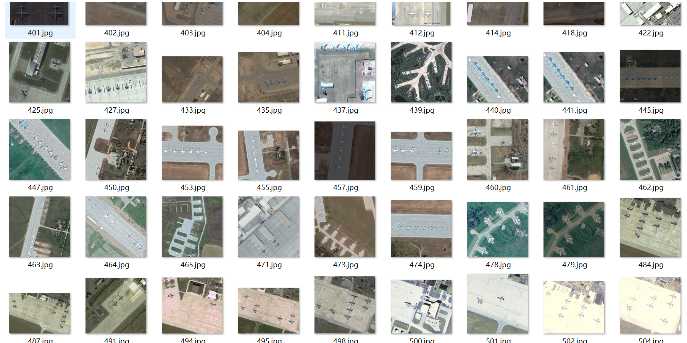

# [Object Detection] Military Remote Sensing Aircraft Detection Dataset 3800 images20-classVOC+YOLO format

Dataset Description: ~

Annotation examples or image overview:

## Images

---

Here is a pay link on Stripe (https://buy.stripe.com/3cs8yP7sY87d0vu9AB). Please contact me lonlonago@foxmail.com after funding $89, and I will send you a complete data files, thank you!

